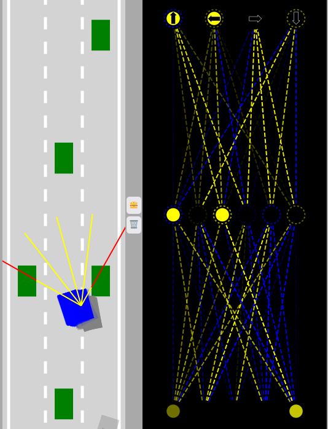

# Self-driving-car

* Catégorie : Projet personnel de développement des compétences

**Self-driving-car** est un mini projet d'initiation en Machine Learning (Neural Network) fait en JS from scratch.

## Utilisation

* Il suffit de lancer le fichier `index.html` dans un navigateur web et d'observer le résultat. 
* Dans l'interface, se trouve à droite l'affichage du réseau de neurones et à gauche l'affichage de la voiture.
* Au centre, sont présents 2 boutons :
  * `Save` : permet de sauvegarder la voiture la plus performante dans le local storage du navigateur.
  * `Discard` : permet de supprimer la voiture sauvegardée dans le local storage du navigateur.

## Exemple

Dans cet exemple, j'ai sauvegardé la meilleure voiture qui a réussi à passer le traffic.

* Animation :

## Auteur

* **[ANRIFOU AMDJAD](https://github.com/Maxiwere45)**

## Crédits

* **[FreeCodeCamp](https://www.freecodecamp.org/)**
* **[Radu Mariescu-Istodor](https://github.com/gniziemazity)**
